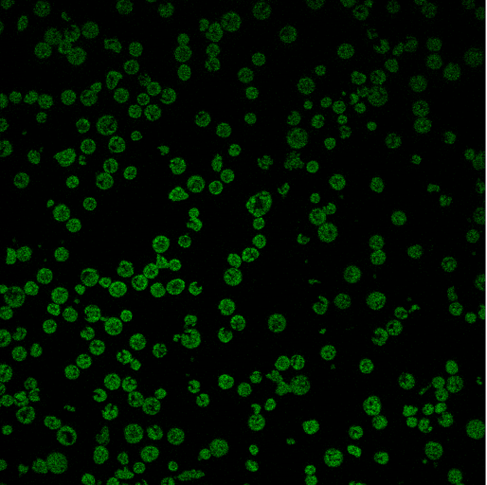
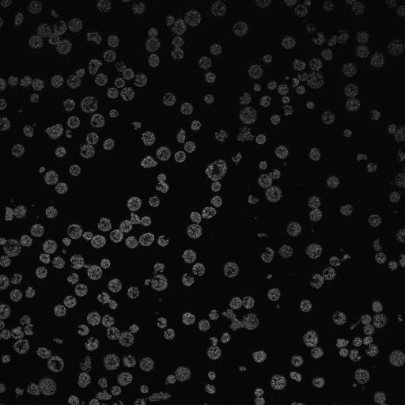
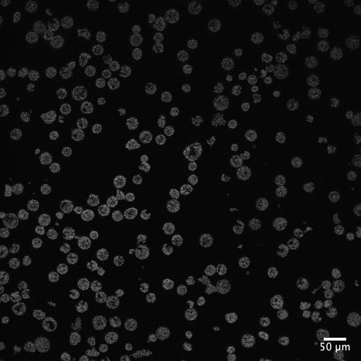
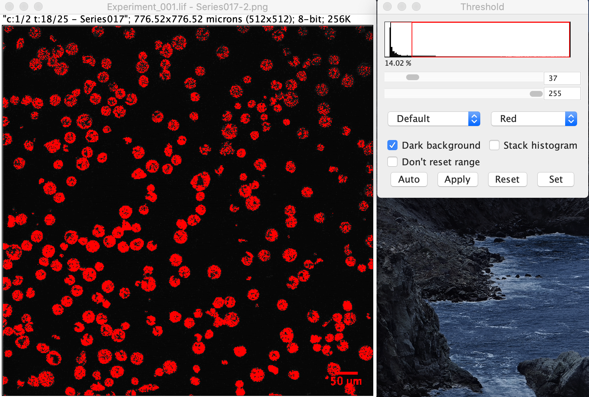
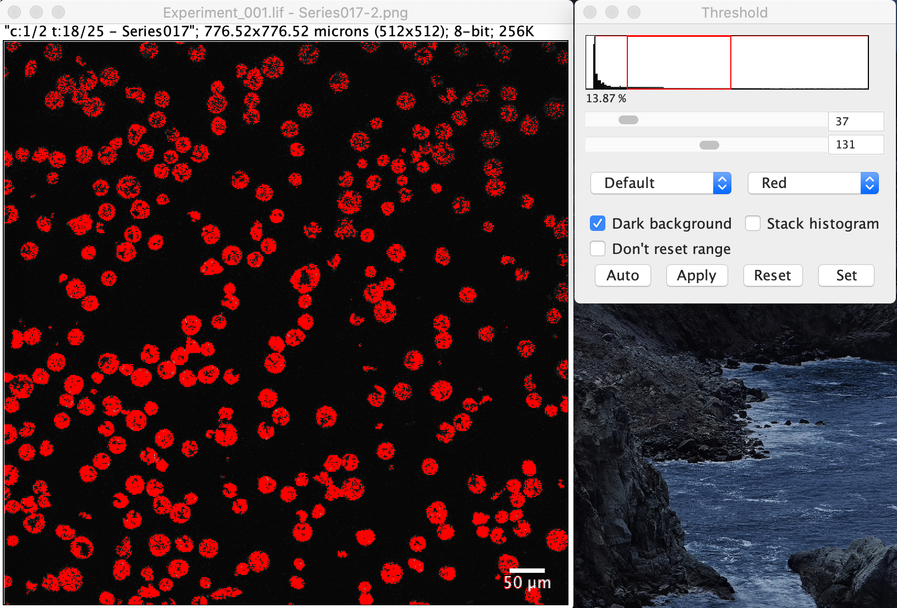
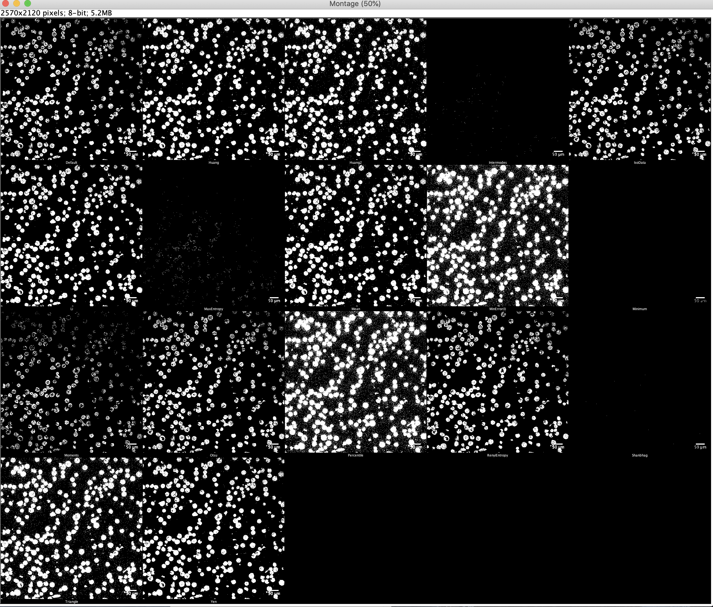
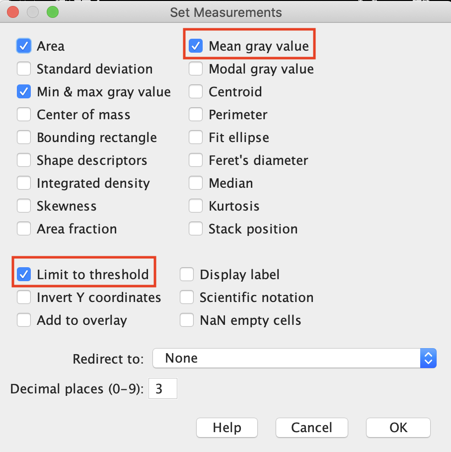
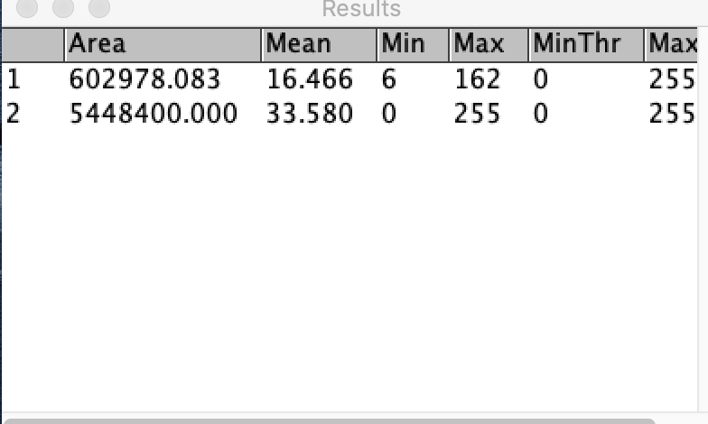

Measuring Average Fluorescence Intensity (Quantitative Analysis)
================

## The definition of average fluorescence intensity

For a single-channel (monochrome) fluorescent image, the grayscale value
of each pixel represents the magnitude of fluorescence intensity at that
point, and the formula for fluorescence intensity in a particular area
is

Mean fluorescence intensity (Mean) = sum of fluorescence intensity of
the area (IntDen) / area(Area)

Mean: Mean gray value IntDen: Integrated Density

## Process

For instance, I would like to measure the mean autofluorescence
intensity of protoplasts.

Some info about the picutures:  
Width: 776.5166 microns (512)  
Height: 776.5166 microns (512)  
Resolution: 0.6594 pixels per micron  
Voxel size: 1.5166x1.5166x1 micron^3  
LambdaBeginLeft\_0 \#1 = 463.058442351106 nm  
LambdaBeginRight\_0 \#1 = 476.058442351106 nm  
LambdaEndLeft\_0 \#1 = 774.551948844613 nm  
LambdaEndRight\_0 \#1 = 787.551948844613 nm  
Number of sections: 25  
Each bin width: 12.45974 nm

  
I take the 17th picture from the series. Therefore, the emission
wavelength for this picture: 463.058442351106 + 17 \* 12.45974 = 674.874
nm

1.  After duplicating the picture, convert it to 8-bit
    <b>(Image-Type-8-bit)</b>.

  

2.  Adjust thresholds and select appropriate areas
    <b>(Image-Adjust-Threshold)</b> This step is optional. It is
    necessary when your pictures have background noises (eg. scale bar)

  

<b>Image-Adjust-Threshold</b>

Adjust the threshod to exclude scale bar. (Right below scale bar turns
white)

  

Now the scale bar is excluded

<b>Caution:

• If there is a scale on the image, you must adjust Threshold to remove
the scale, otherwise it will affect the result.  
• Be sure to use red color to characterize the selected area.  
• Fluorescent images usually have a black background, so you need to
check Dark Background\!  
• No need to click the Apply or Set button, the red part is actually
selected.</b>

3.  Selecting the right threshold <b>(Image-Adjust-Auto Threshold)</b>  
    Choose <b>Method-Try all</b>

Clicking OK will list all thresholds set by the algorithm.  

4.  Set the parameters to be measured <b>(Analyze-Set
    Measurements)</b>  
    

<b>Make sure Mean gray value and Limit to threshold are checked (very
important).</b> If Limit to threshold is unchecked, the measurement is
for the entire image rather than objects in the picture.

5.  <b>Analyze-Measure</b>  
    

The first row is the result of the raw picture. The second row is the
result of the picture with the scale.
